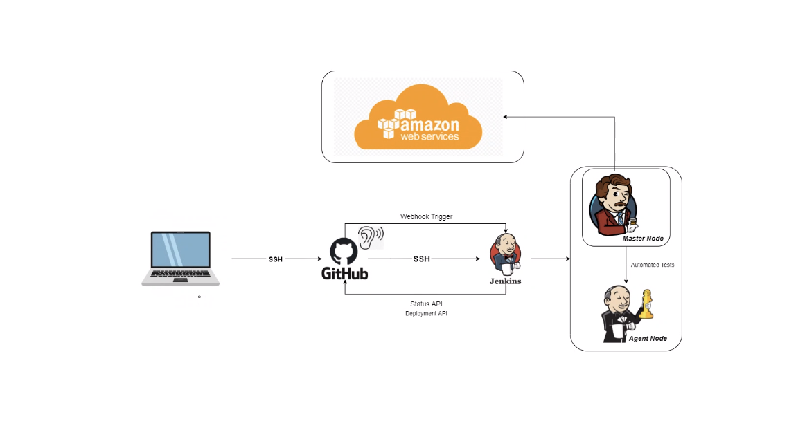

# Jenkins

- Jenkins is an open-source continuous integration tool. Being open-source, it is extremely popular and widely used
- As it reduces the manual steps required to get from writing software to it beign deployedgreatly, software like Jenkins is an essential part of building a DevOps culture
- Huge range of plugins are available, including community-created ones that suit almost any purpose.
- Jenkins can be aimed at a git repository, and will then 
- Jenkins is used to set up pipelines, which run in a series of stages to build a sample of recently pushed changes
- If all tests are passed, these can then be passed on, for example to a dockerhub repository, where they are then ready for deployment
- It is also possible to extend the scope of Jenkins all the way to deployment, or simply to run tests periodically.

- Highly adaptable, and the fact that it is used by a wide variety of huge companies shows that it can be used ot get hte job done.

Development computer has ssh key available, and also a deploy key for git

Jenkins listens to the github and keeps track of any new pushes to the github.

So, need to generate another key that allows jenkins to take the github code

- Good practice is to operate tests on an agent node, which is spun up by the master node. This prevents a bad test from breaking the entire Jenkins server

The basic process will be:

    A developer (in this case, us), adds or changes the code

    The code is pushed to the github repository

    Jenkins notices that a new commit has been pushed to the repo and starts a pipeline, authenticating with the deploy key

To do this, need to set up a webhook:

- Firstly, the settings in jenkins should be to use github

- afte rhtat, it is as simple as setting up the webhook in the github settings for the repo
    - you can see the webhook in the settings on this repo (though the instance may be spun down by now)

